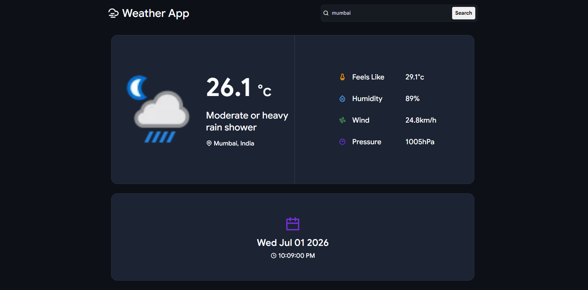

# Weather App

A clean and modern weather application built with **HTML, CSS, and JavaScript** that displays real-time weather information using the WeatherAPI. Search for any city to instantly view its current weather conditions.

## Features

- Search weather by city name
- Displays current temperature in Celsius
- Shows weather condition with icon
- Displays city and country
- Feels Like temperature
- Humidity
- Wind Speed
- Pressure
- Local Date & Time
- Responsive and modern dark-themed UI

## Technologies Used

- HTML5
- CSS3
- JavaScript (ES6)
- WeatherAPI

## Screenshot

## Live Demo

https://ketansdev.github.io/Thunder/Projects/JS-API-Projects/02-weather-app/

## API Used

WeatherAPI

`https://api.weatherapi.com/v1/current.json`

## Learning Outcomes

- Fetch API
- Async/Await
- Working with REST APIs
- DOM Manipulation
- Event Handling
- Dynamic UI Updates
- Error Handling
- Responsive UI Design

## How It Works

1. Enter a city name in the search bar.
2. Click the **Search** button.
3. The application fetches real-time weather data from the WeatherAPI.
4. Weather details are displayed instantly on the screen.

## Weather Information Displayed

- City
- Country
- Temperature (°C)
- Weather Condition
- Weather Icon
- Feels Like Temperature
- Humidity
- Wind Speed
- Pressure
- Local Date & Time