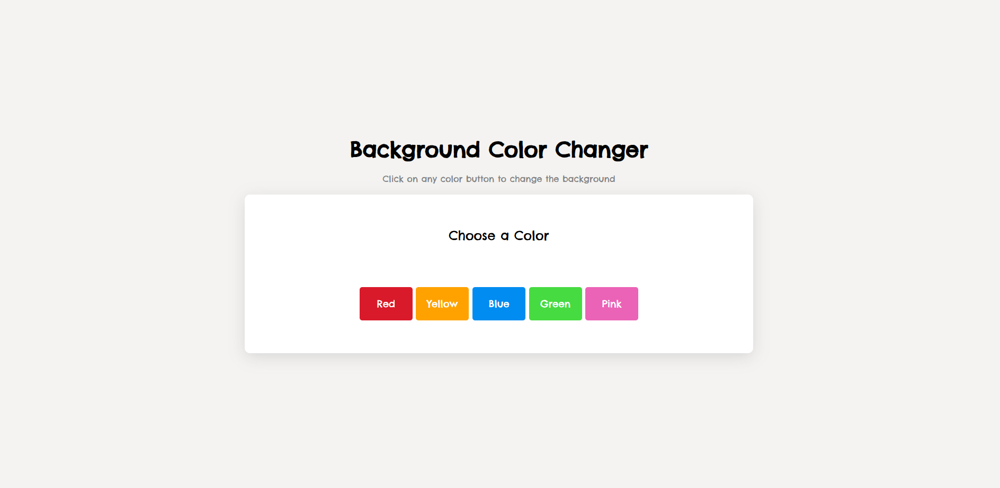

# Background Color Changer

A simple JavaScript DOM project that changes the background color of the page when a color button is clicked.

## Features

* Change background color instantly
* Multiple color options
* Clean and minimal user interface
* Beginner-friendly JavaScript project

## Technologies Used

* HTML
* CSS
* JavaScript

## Screenshot

## Live Demo

https://ketansdev.github.io/Thunder/Projects/JS-Mini-Projects/03-background-color-changer/

## Learning Outcomes

* DOM Selection
* Event Listeners
* Button Click Events
* Style Manipulation using JavaScript
