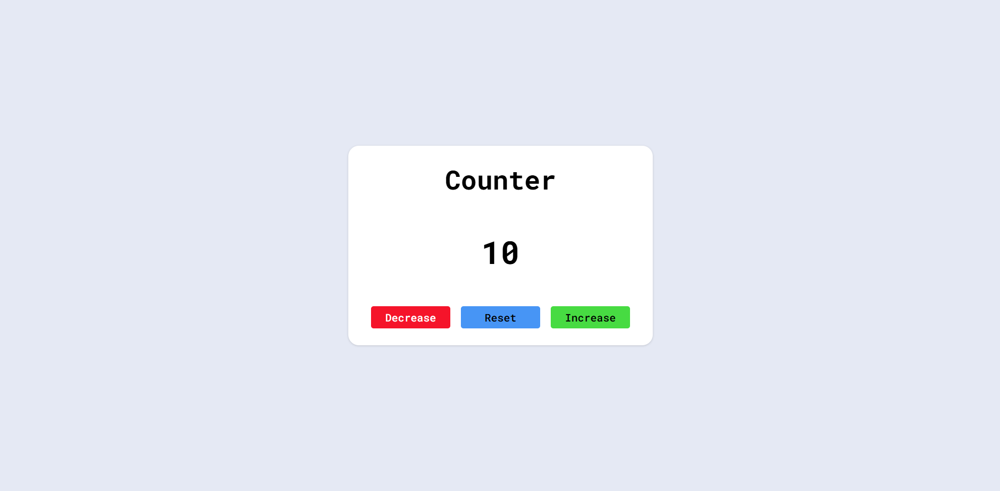

# Counter App

A simple JavaScript DOM project that allows users to increase, decrease, and reset a counter value.

## Features

* Increment Counter
* Decrement Counter
* Reset Counter
* Clean and Minimal UI
* Beginner-friendly JavaScript Project

## Technologies Used

* HTML
* CSS
* JavaScript

## Screenshot

## Live Demo

https://ketansdev.github.io/Thunder/Projects/JS-Mini-Projects/04-counter/

## Learning Outcomes

* DOM Manipulation
* Event Listeners
* Updating Text Content
* Working with Variables and State
