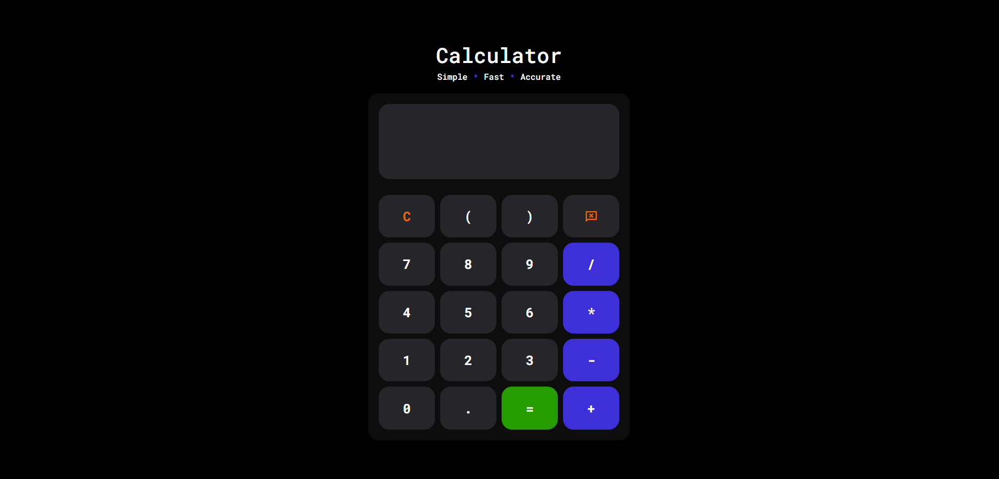

# Calculator

A simple JavaScript Calculator that performs basic arithmetic operations with a clean and modern user interface.

## Features

* Addition
* Subtraction
* Multiplication
* Division
* Clear Display
* Backspace Functionality
* Real-time Input Display
* Error Handling for Invalid Expressions

## Technologies Used

* HTML
* CSS
* JavaScript

## Screenshot

## Live Demo

https://ketansdev.github.io/Thunder/Projects/JS-Mini-Projects/05-calculator/

## Learning Outcomes

* DOM Manipulation
* Event Delegation
* Event Listeners
* Working with User Input
* Dynamic UI Updates
* JavaScript Expressions
