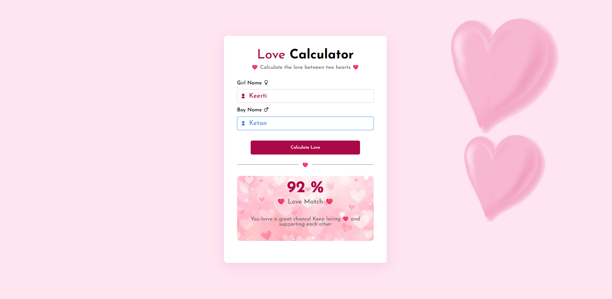

# Love Calculator

A fun JavaScript project that calculates a love percentage based on two names and displays a personalized message.

## Features

* Enter Girl Name
* Enter Boy Name
* Generate Love Percentage
* Dynamic Love Messages
* Clean and Modern UI
* Fun User Experience

## Technologies Used

* HTML
* CSS
* JavaScript

## Screenshot

## Live Demo

https://ketansdev.github.io/Thunder/Projects/JS-Mini-Projects/06-love-calculator/

## Learning Outcomes

* DOM Manipulation
* Form Handling
* Event Listeners
* Conditional Statements
* Dynamic Content Creation
* User Input Validation
