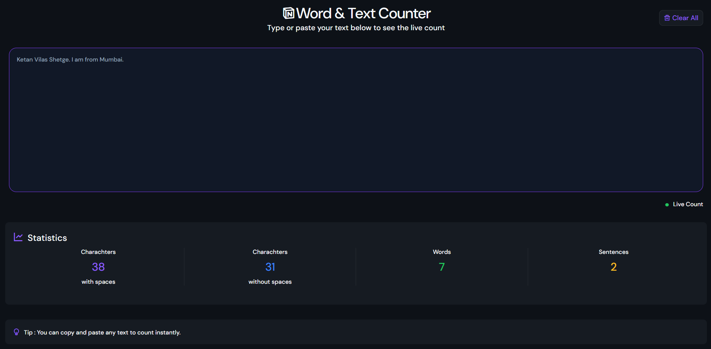

# Word & Text Counter

A simple and responsive Word & Text Counter built using **HTML, CSS, and JavaScript**. It provides live statistics as you type, making it useful for writers, students, and content creators.

## Features

- Live character count (with spaces)
- Live character count (without spaces)
- Live word count
- Live sentence count
- Clear All button
- Responsive design
- Modern dark-themed UI

## Technologies Used

- HTML5
- CSS3
- JavaScript (ES6)

## Screenshot

## Live Demo

https://ketansdev.github.io/Thunder/Projects/JS-Mini-Projects/08-word-and-text-counter/

## Learning Outcomes

- DOM Manipulation
- Event Listeners
- String Methods
- Regular Expressions (Regex)
- Dynamic UI Updates
- Responsive Web Design

## How It Works

1. Type or paste text into the textarea.
2. The statistics update instantly as you type.
3. Click the **Clear All** button to reset the textarea and all counters.

## Statistics Displayed

- Characters (with spaces)
- Characters (without spaces)
- Words
- Sentences