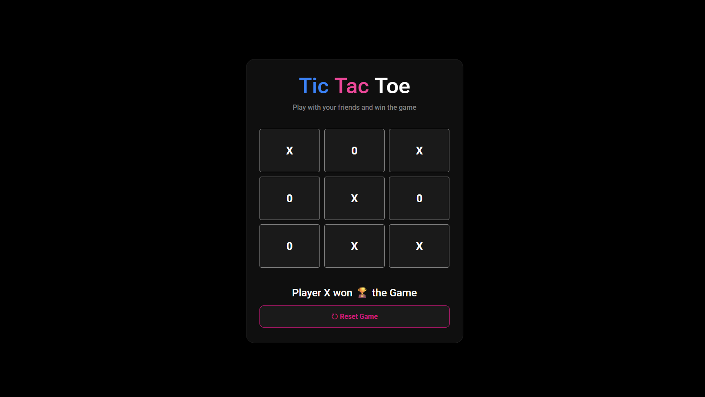

# Tic Tac Toe

A classic Tic Tac Toe game built using HTML, CSS, and JavaScript. Players take turns placing X and O on a 3×3 grid, and the first player to align three symbols in a row, column, or diagonal wins the game.

## Features

* Two Player Gameplay
* Turn Indicator
* Win Detection
* Draw Detection
* Reset Game Functionality
* Modern Dark Theme UI

## Technologies Used

* HTML
* CSS
* JavaScript

## Screenshot

## Live Demo

https://ketansdev.github.io/Thunder/Projects/JS-Mini-Projects/13-Tic-Tac-Toe-Game/

## Learning Outcomes

* DOM Manipulation
* Event Listeners
* Arrays and Loops
* Conditional Logic
* Game State Management
* Winning Combination Checks

## How to Play

1. Player X starts the game.
2. Players take turns selecting a cell.
3. The first player to get three symbols in a row, column, or diagonal wins.
4. If all cells are filled and no player wins, the game ends in a draw.
5. Click the Reset button to start a new game.
